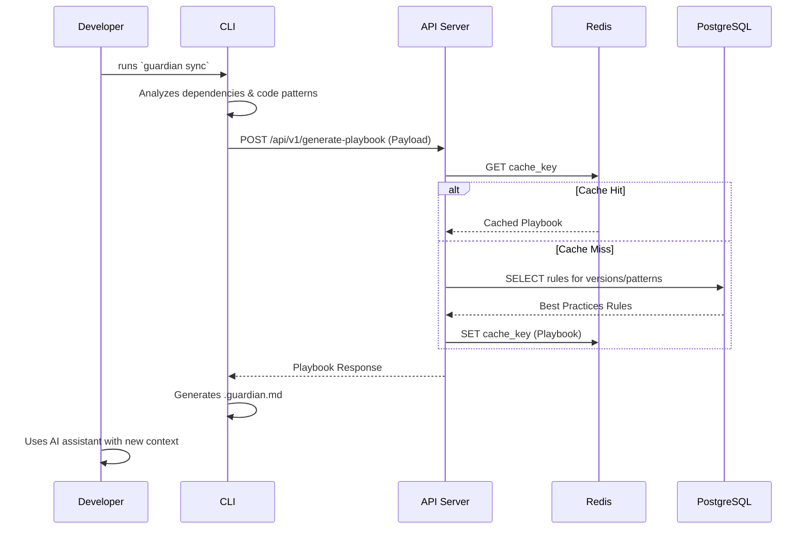

# Context Guardian - Monorepo

## The Problem: AI-Generated Technical Debt

AI coding assistants like GitHub Copilot are revolutionary for developer velocity, but they often produce code that is non-maintainable, insecure, and disconnected from a project's existing patterns. This "vibe coding" leads to a new form of technical debt that is difficult to track and expensive to fix.

## The Solution: Context Guardian

**Context Guardian** is a lightweight, developer-first tool that acts as a living playbook for your AI assistant. It analyzes your project's unique context—its dependencies, versions, and coding patterns—and injects version-aware, pattern-specific best practices directly into your AI's context window. This ensures every line of generated code is aligned with your project's standards from the start, making AI-assisted development both fast and sustainable.

---

## <a name="toc"></a>Table of Contents

1. [Architecture Overview](#architecture)
2. [Data Flow Diagram](#data-flow)
3. [Monorepo Structure](#structure)
4. [Core Packages & Services](#packages)
    - [Database Schema](#db-schema)
    - [Dependency Parser](#dep-parser)
    - [AST Analyzer](#ast-analyzer)
    - [API Server](#api-server)
    - [CLI](#cli)
5. [Technology Stack](#tech-stack)
6. [Development Workflow](#workflow)
7. [Deployment](#deployment)
8. [Roadmap](#roadmap)

---

---

## <a name="architecture"></a>1. Architecture Overview

The Context Guardian ecosystem is designed as a hybrid system that combines local analysis with a centralized, intelligent backend. This allows for fast, private, and powerful analysis.

```mermaid
graph TD
    subgraph Local Environment
        A[CLI @context-guardian/cli] --> B{Project Codebase};
        A --> C[Dependency Parser @context-guardian/dependency-parser];
        A --> D[AST Analyzer @context-guardian/ast-analyzer];
    end

    subgraph Cloud Services (Fly.io/Railway)
        E[API Server @context-guardian/api-server];
        F[PostgreSQL Database];
        G[Redis Cache];
    end

    subgraph Developer Workflow
        H[AI Assistant e.g., Copilot, Cursor];
        I[Generated .guardian.md];
    end

    C -- Dependencies --> A;
    D -- Code Patterns --> A;
    A -- Analysis Payload --> E;
    E -- SQL Query --> F;
    E -- Cache Check --> G;
    G -- Cached Playbook --> E;
    F -- Best Practices --> E;
    E -- Playbook Response --> A;
    A -- Generates --> I;
    I -- Provides Context --> H;

    style A fill:#cde4ff
    style E fill:#d2ffd2
    style I fill:#fff2cd
```

**Components:**

- **CLI (`@context-guardian/cli`)**: The main tool developers interact with. It orchestrates local analysis and communicates with the API.
- **Dependency Parser**: A local module that reads `package.json`, `requirements.txt`, etc., to extract a project's dependencies and versions.
- **AST Analyzer**: A local module using Tree-sitter to parse the codebase and detect project-specific coding patterns (e.g., state management library, component style).
- **API Server**: A backend service that receives the analysis payload, queries the database for relevant best practices, caches the results, and returns a playbook.
- **PostgreSQL Database**: Stores a curated, version-aware knowledge base of best practices, anti-patterns, and security advisories for thousands of libraries.
- **Redis Cache**: Caches playbook responses to ensure sub-50ms response times for repeated requests.
- **`.guardian.md`**: The final output—a Markdown file containing the tailored playbook, which is naturally consumed by AI assistants.

[Back to TOC](#toc)

---

## <a name="data-flow"></a>2. Data Flow Diagram

The data flow is designed to be simple, secure, and efficient.



**Key Data Points:**

- **What is sent to the API?** An anonymized list of dependencies (name, version) and detected code patterns (e.g., `stateManagement: 'zustand'`). **No source code is ever sent.**
- **What is stored in the cache?** The full playbook response, keyed by a hash of the request payload.
- **What is stored in the database?** Curated best practices, not user data.

[Back to TOC](#toc)

---

## <a name="structure"></a>3. Monorepo Structure

This repository uses a standard monorepo structure to manage its different components. Each package and service is independently versioned and configured.

```
context-guardian/
├── package.json                    # Root workspace config (optional)
├── README.md                       # This file
├── docs/
│   └── phase-0_planning/          # Initial planning documents
├── packages/                       # Shared libraries (reusable modules)
│   ├── dependency-parser/         # Extracts project dependencies
│   ├── ast-analyzer/              # Analyzes code for patterns
│   └── shared-types/              # Future: shared TypeScript types
├── services/                       # Backend services
│   └── api-server/                # Main API server
├── apps/                           # User-facing applications
│   ├── cli/                       # The command-line interface
│   └── vscode-extension/          # Future: VS Code extension
└── database/                       # Database schema and seeds
    ├── migrations/
    ├── seeds/
    └── schema.sql
```

[Back to TOC](#toc)

---

## <a name="packages"></a>4. Core Packages & Services

### <a name="db-schema"></a>Database Schema
- **Location**: `database/`
- **Purpose**: Defines the PostgreSQL schema for storing best practices. The core tables are `libraries`, `best_practices`, and `versions`.
- **Key Feature**: Supports semantic version range queries to fetch rules applicable to specific library versions.

### <a name="dep-parser"></a>Dependency Parser
- **Location**: `packages/dependency-parser/`
- **Purpose**: A standalone module that detects the package manager (npm, yarn, pip, etc.) and extracts a clean list of dependencies and their exact versions.
- **Key Feature**: Normalizes version strings (e.g., `^18.2.0` -> `18.2.0`).

### <a name="ast-analyzer"></a>AST Analyzer
- **Location**: `packages/ast-analyzer/`
- **Purpose**: A standalone module that uses Tree-sitter to parse the user's codebase and identify project-specific patterns.
- **Key Feature**: Detects state management libraries, component styles, frameworks, and common coding patterns without sending code off-device.

### <a name="api-server"></a>API Server
- **Location**: `services/api-server/`
- **Purpose**: The backend service that provides the core intelligence. It's the only component that connects to the database.
- **Key Feature**: Always-on architecture (using Fly.io/Railway) with Redis caching to ensure low-latency responses.

### <a name="cli"></a>CLI
- **Location**: `apps/cli/`
- **Purpose**: The primary user-facing application. It orchestrates the analysis and file generation.
- **Key Feature**: Cross-platform (via Node.js) and distributed via npm for easy installation (`npm install -g @context-guardian/cli`).

[Back to TOC](#toc)

---

## <a name="tech-stack"></a>5. Technology Stack

| Component | Technology | Rationale |
|---|---|---|
| **CLI & Modules** | TypeScript, Node.js | Cross-platform, familiar to target audience, rich ecosystem. |
| **Code Analysis** | Tree-sitter | Fast, error-tolerant, multi-language AST parsing. |
| **API Server** | Hono (Node.js) | Lightweight, fast, and modern web framework for APIs. |
| **Database** | PostgreSQL | Robust, relational, and excellent for version range queries. |
| **Cache** | Redis | Industry standard for in-memory caching, ensures low latency. |
| **Deployment** | Docker, Fly.io/Railway | Always-on, low-cost hosting perfect for a responsive API. |

[Back to TOC](#toc)

---

## <a name="workflow"></a>6. Development Workflow

1. **Setup**: Clone the repo and run `npm install` in the root (if using workspaces) or in each package/service directory.
2. **Database**: Set up a local or cloud-based PostgreSQL instance and run the migrations and seeds from the `database/` directory.
3. **API Server**: Configure the `.env` file in `services/api-server/` and run `npm run dev`.
4. **CLI**: Navigate to `apps/cli/` and use `npm link` to make the `guardian` command available globally for testing.
5. **Testing**: Run `npm test` within each package to execute its unit tests.

[Back to TOC](#toc)

---

## <a name="deployment"></a>7. Deployment

- The **API Server** is designed for containerized deployment on an always-on platform like Fly.io or Railway to avoid cold starts. A `Dockerfile` and provider-specific configuration files (`fly.toml`, `railway.json`) are included.
- The **CLI** and other packages will be published to the public npm registry for distribution.

[Back to TOC](#toc)

---

## <a name="roadmap"></a>8. Roadmap

### Phase 0: Foundation & MVP
- **Goal**: Build the core functionality.
- **Deliverables**: Database schema, CLI, API server, parsers for JS/Python ecosystems.

### Phase 1: Launch & Community
- **Goal**: Public launch and gather user feedback.
- **Deliverables**: Public npm packages, VS Code extension, marketing website, community Discord.

### Phase 2: Monetization & Growth
- **Goal**: Introduce paid plans and expand the knowledge base.
- **Deliverables**: Pro/Team plans, private repo support, more languages (Go, Java, C#), CI/CD integration.

### Phase 3: Expansion & Enterprise
- **Goal**: Target large organizations with advanced features.
- **Deliverables**: Self-hosted deployments, custom rule engine, security dashboards, IDE plugins (JetBrains).

[Back to TOC](#toc)
