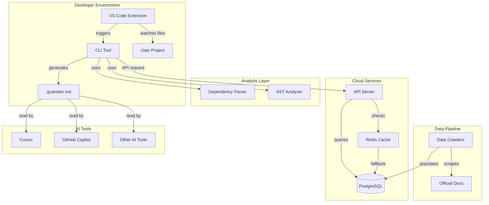
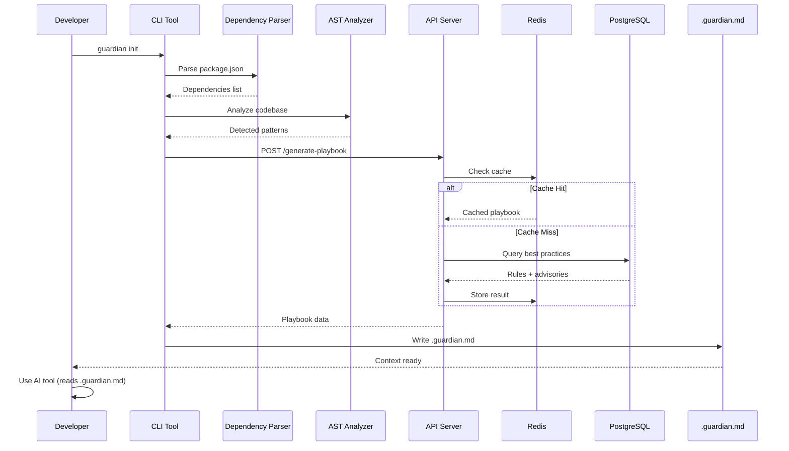

# Context Guardian

**Living, version-aware guardrails for AI-assisted development**

[Back to TOC](#table-of-contents)

---

## Table of Contents

1. [The Problem](#the-problem)
2. [The Solution](#the-solution)
3. [Architecture Overview](#architecture-overview)
4. [Data Flow](#data-flow)
5. [Monorepo Structure](#monorepo-structure)
6. [Core Packages](#core-packages)
7. [Services](#services)
8. [Applications](#applications)
9. [Technology Stack](#technology-stack)
10. [Development Workflow](#development-workflow)
11. [Deployment](#deployment)
12. [Roadmap](#roadmap)

---

## The Problem

AI coding assistants like GitHub Copilot, ChatGPT, and Claude are incredibly fast at generating code. However, they suffer from critical limitations that make their output unsuitable for production environments without significant manual oversight.

**Context Window Limitations**: AI models cannot see your entire codebase. They generate code based on incomplete information, leading to inconsistent patterns, architectural drift, and violations of project-specific conventions.

**Security Blind Spots**: AI models are not aware of the latest Common Vulnerabilities and Exposures (CVEs) or version-specific security issues. Code generated today may contain known vulnerabilities that were disclosed weeks or months ago.

**No Best Practices Enforcement**: AI generates code that "works" but not code that is maintainable. There is no adherence to library-specific patterns, no consideration for your technology stack's best practices, and no awareness of breaking changes between versions.

The result is what industry experts call the **AI Velocity Trap**: teams ship features faster but accumulate technical debt at an unsustainable rate, leading to a maintainability crisis within 6-12 months.

[Back to TOC](#table-of-contents)

---

## The Solution

Context Guardian solves this problem by providing **living, version-aware context** to your AI coding assistant. It automatically analyzes your project, detects your dependencies and patterns, and generates a comprehensive playbook that your AI reads before every code generation.

**Key Innovation**: Instead of trying to integrate with specific AI tools, Context Guardian generates a standard Markdown file (`.guardian.md`) that works with **any** AI coding assistant—Cursor, Copilot, Cline, Aider, ChatGPT, Claude, or any future tool.

**Core Features**:

- Automated dependency analysis and pattern detection
- Version-aware best practices from a curated database
- Automatic security advisory integration (CVE detection)
- Project-specific coding conventions and architecture patterns
- Offline mode with bundled fallback database
- Cross-platform CLI (Mac, Linux, Windows)
- IDE integration (VS Code extension with file watching)

[Back to TOC](#table-of-contents)

---

## Architecture Overview



[Back to TOC](#table-of-contents)

---

## Data Flow



[Back to TOC](#table-of-contents)

---

## Monorepo Structure

```
context-guardian/
├── README.md                       # This file
├── docs/
│   └── phase-0_planning/          # Planning documents
├── packages/                       # Shared libraries (reusable modules)
│   ├── dependency-parser/
│   │   ├── package.json
│   │   ├── src/
│   │   └── dist/
│   ├── ast-analyzer/
│   │   ├── package.json
│   │   ├── src/
│   │   └── dist/
│   └── playbook-generator/
│       ├── package.json
│       ├── src/
│       └── dist/
├── services/                       # Backend services
│   ├── api-server/
│   │   ├── package.json
│   │   ├── src/
│   │   ├── Dockerfile
│   │   └── fly.toml
│   └── offline-fallback/
│       ├── package.json
│       ├── src/
│       └── data/
├── apps/                          # User-facing applications
│   ├── cli/
│   │   ├── package.json
│   │   ├── src/
│   │   └── dist/
│   ├── vscode-extension/
│   │   ├── package.json
│   │   └── src/
│   └── landing-page/
│       ├── package.json
│       └── client/
├── database/                      # Database-related
│   ├── migrations/
│   ├── seeds/
│   └── schema.sql
└── tools/                         # Development tools
    └── data-crawler/
        ├── package.json
        └── src/
```

[Back to TOC](#table-of-contents)

---

## Core Packages

### Dependency Parser

**Location**: `packages/dependency-parser/`

**Purpose**: Detects package manager type and extracts all dependencies with their exact versions from project manifest files.

**Supported Ecosystems**:

- Node.js (npm, yarn, pnpm)
- Python (pip, requirements.txt)
- Rust (cargo, Cargo.toml)

**Key Features**:

- Automatic package manager detection
- Version string normalization (removes `^`, `~`, etc.)
- Distinguishes dev vs production dependencies
- Zero external dependencies (except semver)

---

### AST Analyzer

**Location**: `packages/ast-analyzer/`

**Purpose**: Uses Tree-sitter to analyze source code and detect project-specific patterns and conventions.

**Detected Patterns**:

- State management libraries (Redux, Zustand, MobX, Recoil, Jotai, Context API)
- Component styles (functional, class, mixed)
- Framework detection (React, Next.js, Express, Django, Flask)
- Coding patterns (hooks usage, async patterns, TypeScript adoption)

**Key Features**:

- Tree-sitter integration for 40+ languages
- Error-tolerant parsing
- Fast analysis (~200-500ms for typical projects)
- Configurable file exclusions

---

### Playbook Generator

**Location**: `packages/playbook-generator/`

**Purpose**: Formats API response and local patterns into a structured `.guardian.md` file that AI tools can read.

**Key Features**:

- Handlebars template system
- Multiple output formats (base, Cursor-compatible)
- Severity grouping (critical → high → medium → low)
- Code examples with syntax highlighting
- Offline mode indicators

[Back to TOC](#table-of-contents)

---

## Services

### Offline Fallback

**Location**: `services/offline-fallback/`

**Purpose**: Provides a bundled SQLite database with top 100 libraries for offline functionality.

**Key Features**:

- Export script from PostgreSQL to SQLite
- Version-aware queries (identical to online mode)
- ~2-5 MB database size
- <10ms query performance

---

### API Server

**Location**: `services/api-server/`

**Purpose**: Always-on backend service that receives analysis payloads and returns version-aware best practices.

**Tech Stack**:

- Hono web framework
- PostgreSQL via postgres.js
- Redis caching via ioredis (24hr TTL)
- Zod validation

**Key Endpoints**:

- `POST /api/v1/generate-playbook` - Generate playbook from dependencies + patterns
- `GET /health` - Health check

**Deployment**:

- Fly.io or Railway
- Always-on (no cold starts)
- Handles 100+ req/s on 512MB RAM

[Back to TOC](#table-of-contents)

---

## Applications

### CLI Tool

**Location**: `apps/cli/`

**Purpose**: Main command-line interface that developers use to generate and sync playbooks.

**Commands**:

- `guardian init` - Analyze project and generate initial playbook
- `guardian sync` - Update playbook after dependency changes
- `guardian validate` - Check playbook integrity

**Key Features**:

- Commander.js command structure
- Colored output with Chalk
- Spinner animations with Ora
- Environment variable configuration
- Programmatic API for library use

---

### VS Code Extension

**Location**: `apps/vscode-extension/`

**Purpose**: IDE integration that watches for dependency changes and automatically triggers CLI.

**Key Features**:

- Watches 5 dependency file types (package.json, requirements.txt, Cargo.toml, Gemfile, go.mod)
- Debounced file watching (2-second delay)
- Progress notifications with metadata
- Configuration options (autoSync, cliPath, showNotifications)

**Commands**:

- `Context Guardian: Sync Playbook`
- `Context Guardian: Enable Auto-Sync`
- `Context Guardian: Disable Auto-Sync`
- `Context Guardian: View Playbook`

---

### Landing Page

**Location**: `apps/landing-page/`

**Purpose**: Marketing website with waitlist signup.

**Tech Stack**:

- Next.js static site
- Tailwind CSS
- Deployed on Vercel

[Back to TOC](#table-of-contents)

---

## Technology Stack

| Component         | Technology            | Rationale                                                     |
| ----------------- | --------------------- | ------------------------------------------------------------- |
| **CLI**           | TypeScript + Node.js  | Target audience familiarity, npm distribution, fast iteration |
| **Code Analysis** | Tree-sitter           | 40+ languages, error-tolerant, incremental parsing            |
| **API Server**    | Hono + Node.js        | Lightweight, fast, TypeScript-native                          |
| **Database**      | PostgreSQL            | Relational data, version range queries, proven reliability    |
| **Caching**       | Redis (Upstash)       | 24hr TTL, reduces DB load, <50ms cache hits                   |
| **Offline DB**    | SQLite                | Single-file, embeddable, identical query interface            |
| **Deployment**    | Fly.io / Railway      | Always-on, no cold starts, affordable ($5/month)              |
| **IDE Extension** | VS Code Extension API | Largest developer audience, mature extension ecosystem        |
| **Landing Page**  | Next.js + Vercel      | Static export, edge CDN, zero config deployment               |

[Back to TOC](#table-of-contents)

---

## Development Workflow

### Initial Setup

1. **Clone the repository**

   ```bash
   git clone https://github.com/yourusername/context-guardian.git
   cd context-guardian
   ```

2. **Install dependencies for each package**

   ```bash
   cd packages/dependency-parser && npm install && npm run build
   cd ../ast-analyzer && npm install && npm run build
   cd ../playbook-generator && npm install && npm run build
   cd ../../services/offline-fallback && npm install && npm run build
   ```

3. **Set up database**

   ```bash
   cd database
   ./scripts/setup_database.sh
   ```

4. **Start API server**

   ```bash
   cd services/api-server
   cp .env.example .env
   # Edit .env with your database credentials
   npm install
   npm run dev
   ```

5. **Build CLI**
   ```bash
   cd apps/cli
   npm install
   npm run build
   npm link
   ```

### Testing the Full Flow

1. **Create a test project**

   ```bash
   mkdir test-project
   cd test-project
   npm init -y
   npm install react@18.2.0
   ```

2. **Run Context Guardian**

   ```bash
   guardian init
   ```

3. **Verify output**
   - Check that `.guardian.md` was created
   - Review the content for React 18.2.0-specific guidance
   - Test with your AI coding tool (Cursor, Copilot, etc.)

[Back to TOC](#table-of-contents)

---

## Deployment

### API Server (Fly.io)

```bash
cd services/api-server
fly launch
fly secrets set DATABASE_URL=your_postgres_url
fly secrets set REDIS_URL=your_redis_url
fly deploy
```

### CLI (npm)

```bash
cd apps/cli
npm run build
npm publish
```

### VS Code Extension (Marketplace)

```bash
cd apps/vscode-extension
npm run package
vsce publish
```

### Landing Page (Vercel)

```bash
cd apps/landing-page
vercel
```

[Back to TOC](#table-of-contents)

---

## Roadmap

### Phase 0: Foundation & MVP (Current)

**Goal**: Prove the concept with a working CLI for JavaScript/TypeScript projects.

**Deliverables**:

- ✅ Database schema with top 20 libraries seeded
- ✅ Dependency parser for npm/yarn/pnpm
- ✅ AST analyzer for JS/TS
- ✅ API server with caching
- ✅ CLI with init/sync commands
- ✅ Offline fallback with SQLite
- ✅ Playbook generator with Markdown output
- ✅ VS Code extension (basic)
- ✅ Landing page with waitlist

**Success Metrics**:

- CLI generates accurate playbooks for React/Next.js projects
- 100+ waitlist signups
- Positive feedback from 5+ beta testers

---

### Phase 1: Launch & Community (Months 1-3)

**Goal**: Launch publicly, build community, and expand library coverage.

**Deliverables**:

- Public launch on Product Hunt, Hacker News, Reddit
- Expand database to top 100 npm packages
- Add Python ecosystem support (pip, Django, Flask)
- Community-contributed best practices (GitHub repo)
- Documentation site (docs.contextguardian.com)
- Discord community for support

**Success Metrics**:

- 5,000+ CLI installs
- 1,000+ active weekly users
- 50+ community-contributed best practices
- 4.5+ star rating on VS Code Marketplace

---

### Phase 2: Monetization & Growth (Months 4-6)

**Goal**: Introduce paid tiers and scale to 10,000+ users.

**Deliverables**:

- Freemium business model (free for individuals, paid for teams)
- Team features (shared playbooks, org-wide standards)
- Advanced pattern detection (semantic analysis, not just syntax)
- JetBrains plugin (IntelliJ, PyCharm, WebStorm)
- API for third-party integrations
- Enterprise self-hosted option

**Success Metrics**:

- 10,000+ total users
- $10K+ MRR
- 50+ paying teams
- 90%+ retention rate

---

### Phase 3: Expansion & Enterprise (Months 7-12)

**Goal**: Become the standard for AI coding guardrails in enterprises.

**Deliverables**:

- Support for 10+ programming languages
- Compliance features (SOC 2, audit logs, role-based access)
- Custom rule authoring (enterprise customers can add proprietary rules)
- Integration with CI/CD pipelines (GitHub Actions, GitLab CI)
- Analytics dashboard (code quality trends, AI usage patterns)
- White-label option for large enterprises

**Success Metrics**:

- 50,000+ total users
- $100K+ MRR
- 10+ enterprise customers ($50K+ ACV)
- Industry recognition (awards, conference talks)

[Back to TOC](#table-of-contents)

---

## Contributing

We welcome contributions! Please see [CONTRIBUTING.md](CONTRIBUTING.md) for guidelines.

## License

MIT License - see [LICENSE](LICENSE) for details.

## Contact

- Website: [contextguardian.com](https://contextguardian.com)
- Email: hello@contextguardian.com
- Discord: [Join our community](https://discord.gg/contextguardian)

---

**Built with ❤️ by developers who care about sustainable AI-assisted development.**

[Back to TOC](#table-of-contents)
