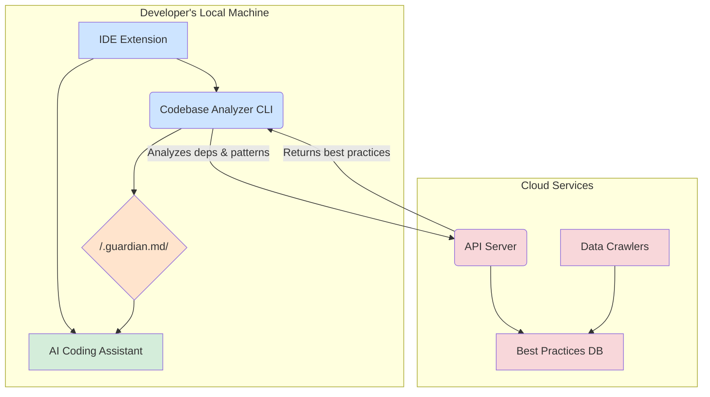
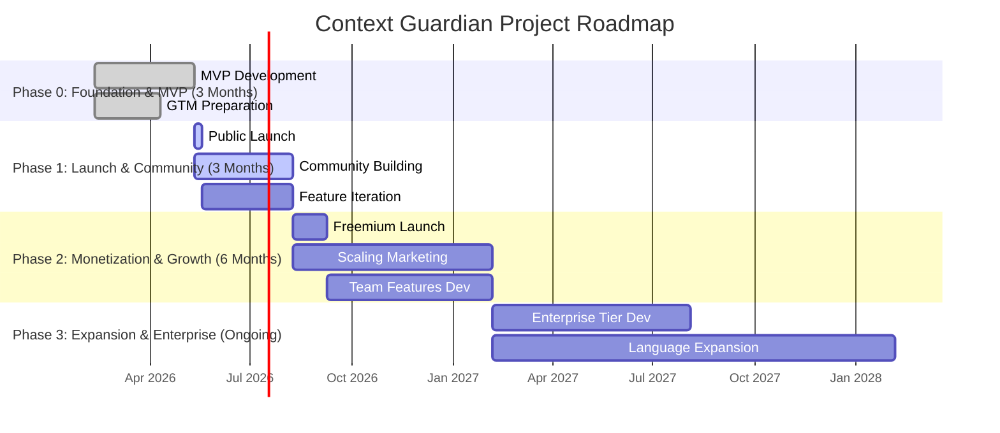

# Context Guardian: A Comprehensive Project Plan

## Introduction

This document provides a comprehensive, phase-by-phase execution plan for **Context Guardian**, a novel developer tool designed to solve the critical problem of AI-generated code quality and maintainability. Our research has identified a significant market gap: developers are rapidly adopting AI coding assistants but lack the tools to ensure the generated code adheres to project-specific standards, architectural patterns, and version-aware best practices. This leads to a surge in technical debt, security vulnerabilities, and long-term maintenance costs.

Context Guardian addresses this by acting as a **living, automated playbook for AI assistants**. It analyzes a project's unique context, fetches up-to-date, version-specific best practices from a cloud database, and injects this tailored guidance directly into the AI's context window. This ensures every line of generated code is secure, maintainable, and aligned with the project's specific needs from the start.

This plan maps out every critical aspect of the project, from product architecture and technology stack to a phased execution roadmap and a developer-first go-to-market strategy. Each stage includes a thorough gap analysis to identify potential risks and outline clear mitigation strategies, providing a complete blueprint for bringing Context Guardian to market.

market.

---

## Part I: Product Architecture & Technical Specifications

This section details the technical blueprint for Context Guardian, outlining the core components, their interactions, and the guiding principles behind the design.

### 1. Guiding Principles

The architecture of Context Guardian is designed around three core principles:

- **Frictionless Developer Experience**: The tool must be easy to install, require zero configuration to get started, and run in the background without disrupting the developer's workflow.
- **Living, Dynamic Context**: The context provided to the AI must never be stale. It must automatically adapt to changes in the codebase, dependencies, and the broader ecosystem.
- **Precision over Volume**: Instead of flooding the context window, we provide a concise, highly relevant, and structured playbook that guides the AI effectively.

### 2. High-Level System Architecture

Context Guardian operates as a distributed system composed of three primary components: a **Codebase Analyzer (CLI)** that runs locally, **Cloud Services** that provide intelligence, and an **IDE Integration** that connects the two within the developer's editor.

| Component | Location | Responsibility |
| :--- | :--- | :--- |
| **IDE Extension** | Local | Orchestrates the process, triggers analysis, and injects context. |
| **Codebase Analyzer (CLI)** | Local | Scans the project, identifies the tech stack, and communicates with the cloud API. |
| **Cloud Services** | Cloud | Maintains a database of version-specific best practices and serves them via an API. |

### 3. Component Deep Dive: Codebase Analyzer (CLI)

This is the primary local intelligence unit of Context Guardian, responsible for understanding the project's unique fingerprint.

- **Technology**: TypeScript/Node.js, distributed via npm.
- **Core Libraries**: `commander.js` (for commands), `tree-sitter` (for AST parsing), `glob` (for file discovery).

**Workflow**:

1.  **Invocation**: The CLI is triggered by the `guardian init` command or automatically by the IDE extension upon detecting project changes (e.g., a change in `package.json`).
2.  **Dependency Scan**: It first identifies the project's package manager (`npm`, `yarn`, `pnpm`, `pip`, `cargo`, etc.) and parses the relevant dependency files (`package.json`, `requirements.txt`, `Cargo.toml`). This produces a precise manifest of all libraries and their versions.
3.  **High-Level Context Ingestion**: The analyzer reads the project's `README.md` file, using the first one or two paragraphs to establish a high-level description of the project's purpose.
4.  **Local Pattern Analysis (AST)**: This is the core of the local analysis. Using Tree-sitter, the CLI performs a lightweight static analysis on a sample of the codebase to identify recurring, project-specific patterns. For an MVP, this includes:
    -   Identifying commonly imported internal modules (e.g., custom UI components, utility functions).
    -   Detecting the primary function/component declaration style.
    -   Recognizing the state management library in use (e.g., Redux, Zustand, or just React hooks).
5.  **API Communication**: The collected information (dependency manifest, project description, and learned patterns) is bundled into a secure API request to the Cloud Services.
6.  **Playbook Generation**: Upon receiving the tailored best practices from the cloud, the CLI merges this information with the locally discovered patterns and writes the final, structured `.guardian.md` playbook to the project's root directory.

**Gap Analysis**: The AST-based pattern recognition is powerful but complex. The initial version will focus on high-signal, easy-to-detect patterns like import statements. More sophisticated analysis, like detecting custom architectural patterns (e.g., specific data flow in a Flux architecture), will be a focus for future iterations. Supporting the nuances of every package manager is also a significant undertaking that will be rolled out progressively.

### 4. Component Deep Dive: Cloud Services

This is the centralized brain of Context Guardian, providing the version-aware, ecosystem-wide intelligence.

- **API Server**: Built with Node.js (Hono/Express) on Vercel, it receives analysis payloads and returns tailored playbooks.
- **Best Practices Database**: A PostgreSQL database (managed via Supabase) storing version-specific rules, anti-patterns, and security advice.
- **Data Crawlers**: Scheduled serverless functions that periodically ingest data from official documentation, security advisories, and community forums to keep the database current.

**Gap Analysis**: The quality and accuracy of the ingested data are paramount. A human-in-the-loop moderation process will be essential, especially in the early stages, to validate and curate the information collected by the crawlers before it goes live in the database. Building a robust and reliable crawling infrastructure is a significant engineering effort.

### 5. Data Flow & Security

Security is a non-negotiable design principle.

- **Local-First Analysis**: The Codebase Analyzer **never sends source code to the cloud**. All AST parsing happens locally. Only the dependency list, versions, and anonymized high-level patterns are sent.
- **Secure Communication**: All API communication is over HTTPS with API key authentication for paid tiers.
- **Sandboxed Environment**: The IDE extension operates within the IDE's security sandbox, with permissions limited to reading project files and writing to the `.guardian.md` file.

**Gap Analysis**: As the tool gains traction, it could become a target. A third-party security audit will be necessary before any major release handling customer payment data. Continuous monitoring for supply chain vulnerabilities within our own dependencies is critical.

---

## Part II: Technology Stack

This section details the technology choices for each component of Context Guardian, selected to optimize for developer experience, performance, and speed of iteration.

| Component | Technology | Rationale |
| :--- | :--- | :--- |
| **CLI Tool** | **TypeScript + Node.js** | The primary target audience (web developers) is already deeply familiar with the Node.js and npm ecosystem, ensuring low friction for adoption and contribution. Distribution via `npm` is simple and standardized. |
| **Code Analysis Engine** | **Tree-sitter** | This best-in-class parsing library is the core of our local analysis. Its speed, error tolerance, and support for over 40 languages allow us to build a powerful and scalable analysis engine that understands code structure, not just text. |
| **IDE Integration** | **TypeScript + VS Code API** | We will target VS Code first due to its 75%+ market share. Its robust extension API allows for deep integration, including file watchers and context providers. We will ensure compatibility with Cursor by formatting our output to work with their existing `.cursorrules` system. |
| **Cloud Database** | **PostgreSQL (via Supabase)** | PostgreSQL provides the structured, relational data model needed for our Best Practices DB. We chose Supabase for the MVP to leverage its generous free tier, managed infrastructure, and auto-generated APIs, allowing us to move faster. |
| **API Backend** | **Node.js (Hono/Express on Vercel)** | Using Node.js for the backend allows for potential code sharing with the CLI and keeps the tech stack consistent. Deploying on Vercel provides a serverless, auto-scaling, and cost-effective platform for the API. |
| **Deployment & Monitoring** | **Vercel, npm, Sentry, PostHog** | The CLI will be distributed via npm. The cloud services will be hosted on Vercel. We will use Sentry for error tracking and PostHog for product analytics to gain deep insights into user behavior. |

---

## Part III: Go-to-Market Strategy & Business Model

This section outlines our developer-first go-to-market (GTM) strategy and a phased business model designed to build trust, foster community, and create a sustainable revenue stream.

### 1. Go-to-Market: A Developer-First Approach

Our GTM strategy is built on the principle that **the product is the marketing**. We will win by building a tool that developers love and by engaging with the community authentically.

- **Primary Channels**: Our efforts will be concentrated on channels where developers actively seek solutions: **GitHub** (our primary distribution channel), **Search/SEO** (through high-quality tutorials), and **Communities** (Hacker News, Reddit, Dev.to).
- **Content Strategy**: Our content will be our most powerful marketing tool. We will produce deep, technical tutorials, use cases, and thought leadership articles that provide genuine value. **Documentation is marketing. Code examples are marketing. Community engagement is marketing.**
- **Founder-Led Growth**: In the early stages, the founders will be the face of the company. They will be active on social media, engage directly in community discussions, and share the development journey openly to build credibility and trust.

### 2. Business Model: Phased Freemium

We will adopt a freemium model designed to maximize adoption while creating a clear path to revenue.

| Tier | Price | Target Audience | Key Features |
| :--- | :--- | :--- | :--- |
| **Free** | $0 | Individual developers, students, and open-source projects | Core local analysis, generous free tier for cloud API, community support. |
| **Pro** | ~$15/month | Professional developers | Higher API limits, priority access to new best practices, email support. |
| **Team** | ~$50/month (for 5 devs) | Small to medium-sized teams | Shared team playbooks, centralized billing, SSO, priority support. |
| **Enterprise** | Custom | Large organizations | Self-hosted deployment, custom data sources, SLA, dedicated support. |

**Key Principle**: The free tier must be genuinely useful and powerful enough to become an indispensable part of a developer's workflow. We will monetize based on the advanced needs of professional developers and the collaboration requirements of teams.

---

## Part IV: Phased Execution Roadmap

This section outlines a comprehensive, phase-by-phase plan for the development, launch, and growth of Context Guardian. It integrates product development, go-to-market strategy, and business operations, with a critical analysis of potential gaps and risks at each stage.

### Overall Project Timeline

### Phase 0: Foundation & MVP Development (Months 1-3)

**Primary Goal**: Build a functional, high-quality Minimum Viable Product (MVP) and prepare for a strong public launch. The focus is on core functionality and establishing initial credibility.

| Stream | Key Activities & Deliverables | Gap Analysis & Mitigation |
| :--- | :--- | :--- |
| **Product & Engineering** | Develop the core CLI tool, integrate Tree-sitter for basic analysis, set up the cloud backend, and manually seed the database with rules for the top 20 JS/Python libraries. | **Gap**: Initial data quality is critical; poor advice will destroy trust.   **Mitigation**: Manually curate all initial rules and link to sources. Defer complex analysis to focus on a high-quality MVP. |
| **Marketing & GTM** | Write foundational technical content, create a landing page with a waitlist, write comprehensive documentation, and build a small beta community on Discord. | **Gap**: Launching without a pre-existing audience.   **Mitigation**: Start content marketing and founder-led social media engagement from day one. Treat documentation as a primary marketing asset. |
| **Business & Operations** | Define initial KPIs (GitHub stars, beta feedback quality), draft legal documents (ToS, Privacy Policy), and establish a structured feedback loop. | **Gap**: Ignoring early feedback.   **Mitigation**: The founding team must be deeply involved in the beta community, responding to all feedback personally. |

### Phase 1: Public Launch & Community Building (Months 4-6)

**Primary Goal**: Successfully launch the free version, drive initial adoption, and build a vibrant, engaged community.

| Stream | Key Activities & Deliverables | Gap Analysis & Mitigation |
| :--- | :--- | :--- |
| **Product & Engineering** | Publish the CLI to npm and the extension to the VS Code Marketplace. Dedicate 80% of engineering time to rapid iteration based on community feedback. | **Gap**: A buggy initial release can damage reputation.   **Mitigation**: Conduct rigorous testing with the beta community before launch and have a hotfix process ready. |
| **Marketing & GTM** | Execute a coordinated launch across Hacker News, Reddit, and Product Hunt. Manage the community actively and begin outreach to developer-focused content creators. | **Gap**: The launch gets lost in the noise.   **Mitigation**: Sharpen the launch message to focus on the core pain point. Use compelling demos and testimonials from beta testers. |
| **Business & Operations** | Track growth metrics, with a focus on Weekly Active Users (WAU) as the North Star. Begin planning the architecture for paid tiers based on user requests. | **Gap**: Focusing on vanity metrics (e.g., stars) over active usage.   **Mitigation**: Prioritize WAU to measure true product-market fit. |

### Phase 2: Monetization & Growth (Months 7-12)

**Primary Goal**: Introduce paid tiers, validate the business model, and begin scaling user acquisition.

| Stream | Key Activities & Deliverables | Gap Analysis & Mitigation |
| :--- | :--- | :--- |
| **Product & Engineering** | Integrate Stripe for billing. Develop Pro/Team features like higher API limits and shared playbooks. Implement user accounts and SSO. | **Gap**: The value proposition for paid tiers may be too weak.   **Mitigation**: Base paid features directly on problems identified in the community. Offer a discount to early adopters to drive conversion. |
| **Marketing & GTM** | Announce paid tiers. Begin small, targeted ad campaigns on developer platforms and sponsor high-quality newsletters or channels. | **Gap**: Inauthentic marketing can backfire.   **Mitigation**: All marketing must remain developer-first, pointing to technical content, not sales pages. |
| **Business & Operations** | Track business metrics (MRR, conversion rate, churn). Make the first non-founder hire (Developer Advocate). Build a financial model to project revenue. | **Gap**: Hiring the wrong first employee.   **Mitigation**: The first hire must be a strong cultural fit—a developer who loves community. Involve beta users in the interview process. |

### Phase 3: Expansion & Enterprise (Months 13+)

**Primary Goal**: Scale the business by capturing the enterprise market and establishing Context Guardian as an industry standard.

| Stream | Key Activities & Deliverables | Gap Analysis & Mitigation |
| :--- | :--- | :--- |
| **Product & Engineering** | Develop a self-hosted version. Add enterprise-grade features (RBAC, audit logs). Aggressively expand language support. Launch a public API. | **Gap**: Enterprise requirements (security, compliance) are stringent.   **Mitigation**: Achieve SOC 2 certification. Dedicate an engineering team to focus solely on security and reliability. |
| **Marketing & GTM** | Build a technical enterprise sales team. Engage with industry analysts (Gartner, Forrester). Form strategic partnerships with IDE vendors and cloud providers. | **Gap**: Bottom-up GTM doesn’t automatically translate to top-down sales.   **Mitigation**: Hire a sales leader with experience selling developer tools to the enterprise. |
| **Business & Operations** | Raise a Series A to fund expansion. Hire key leadership roles. Begin international expansion and build a formal, 24/7 support organization for enterprise customers. | **Gap**: Scaling culture is difficult.   **Mitigation**: Codify the company mission and values early. Maintain a rigorous hiring process that screens for cultural alignment. |
