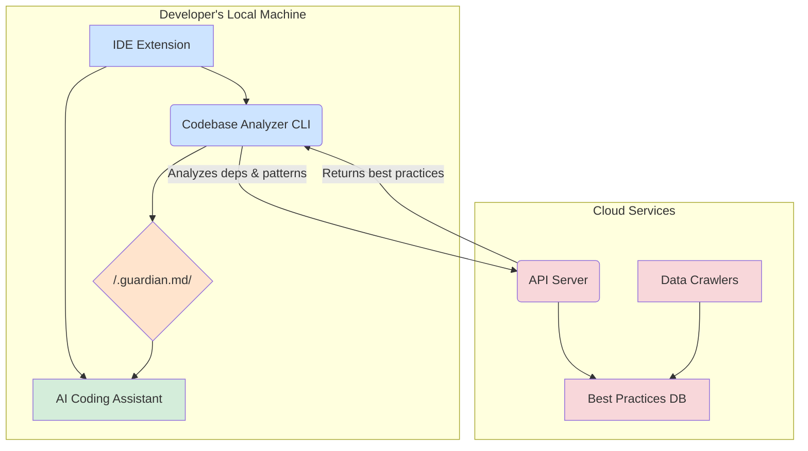
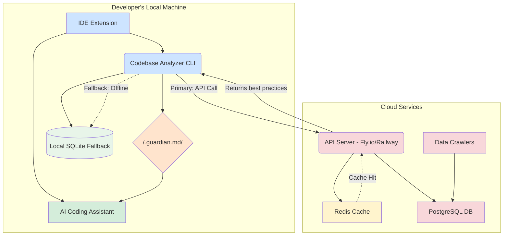
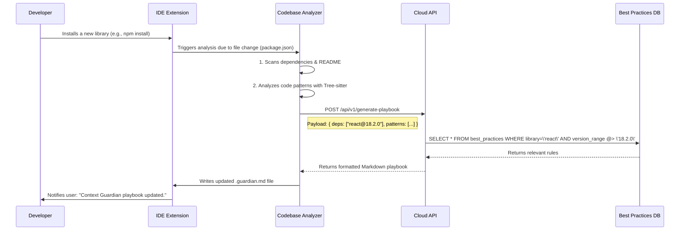

# Context Guardian: Product Architecture & Technical Specifications

## 1. Guiding Principles

The architecture of Context Guardian is designed around three core principles:

- **Frictionless Developer Experience**: The tool must be easy to install, require zero configuration to get started, and run in the background without disrupting the developer's workflow.
- **Living, Dynamic Context**: The context provided to the AI must never be stale. It must automatically adapt to changes in the codebase, dependencies, and the broader ecosystem.
- **Precision over Volume**: Instead of flooding the context window, we provide a concise, highly relevant, and structured playbook that guides the AI effectively.

## 2. High-Level System Architecture

Context Guardian operates as a distributed system composed of three primary components: a **Codebase Analyzer (CLI)** that runs locally, **Cloud Services** that provide intelligence, and an **IDE Integration** that connects the two within the developer's editor.

| Component | Location | Responsibility |
| :--- | :--- | :--- |
| **IDE Extension** | Local | Orchestrates the process, triggers analysis, and injects context. |
| **Codebase Analyzer (CLI)** | Local | Scans the project, identifies the tech stack, and communicates with the cloud API. |
| **Cloud Services** | Cloud | Maintains a database of version-specific best practices and serves them via an API. |

---
).

**Gap Analysis**: Different AI assistants have different mechanisms for context injection. The extension will need to be modular to support multiple providers. For tools without a formal context API, we may need to use workarounds like temporarily appending the playbook to the active editor's content in memory.

---

## 3. Component Deep Dive: Codebase Analyzer (CLI)

This is the primary local intelligence unit of Context Guardian, responsible for understanding the project's unique fingerprint.

- **Technology**: TypeScript/Node.js, distributed via npm.
- **Core Libraries**: `commander.js` (for commands), `tree-sitter` (for AST parsing), `glob` (for file discovery).

### Workflow:

1.  **Invocation**: The CLI is triggered by the `guardian init` command or automatically by the IDE extension upon detecting project changes (e.g., a change in `package.json`).
2.  **Dependency Scan**: It first identifies the project's package manager (`npm`, `yarn`, `pnpm`, `pip`, `cargo`, etc.) and parses the relevant dependency files (`package.json`, `requirements.txt`, `Cargo.toml`). This produces a precise manifest of all libraries and their versions.
3.  **High-Level Context Ingestion**: The analyzer reads the project's `README.md` file, using the first one or two paragraphs to establish a high-level description of the project's purpose.
4.  **Local Pattern Analysis (AST)**: This is the core of the local analysis. Using Tree-sitter, the CLI performs a lightweight static analysis on a sample of the codebase to identify recurring, project-specific patterns. For an MVP, this includes:
    -   Identifying commonly imported internal modules (e.g., custom UI components, utility functions).
    -   Detecting the primary function/component declaration style.
    -   Recognizing the state management library in use (e.g., Redux, Zustand, or just React hooks).
5.  **API Communication**: The collected information (dependency manifest, project description, and learned patterns) is bundled into a secure API request to the Cloud Services.
6.  **Playbook Generation**: Upon receiving the tailored best practices from the cloud, the CLI merges this information with the locally discovered patterns and writes the final, structured `.guardian.md` playbook to the project's root directory.

**Gap Analysis**: The AST-based pattern recognition is powerful but complex. The initial version will focus on high-signal, easy-to-detect patterns like import statements. More sophisticated analysis, like detecting custom architectural patterns (e.g., specific data flow in a Flux architecture), will be a focus for future iterations. Supporting the nuances of every package manager is also a significant undertaking that will be rolled out progressively.

---

## 4. Component Deep Dive: Cloud Services

This is the centralized brain of Context Guardian, providing the version-aware, ecosystem-wide intelligence.

### 4.1. API Server

- **Technology**: Node.js with a lightweight framework like Hono or Express, deployed as an always-on server on Fly.io or Railway to eliminate cold start latency.
- **Primary Endpoint**: `POST /api/v1/generate-playbook`
- **Logic**: The API server receives the analysis payload from the CLI. For each dependency, it queries the Best Practices Database using the library name and its specific version. It then collates all relevant rules, formats them into a concise Markdown document, and returns it to the CLI.

### 4.2. Best Practices Database

- **Technology**: PostgreSQL, managed via Supabase for its generous free tier, ease of use, and built-in API capabilities.
- **Schema**: The database will store rules, best practices, and anti-patterns, each tied to a specific library and a semantic version range. This allows for highly precise lookups (e.g., fetching rules that apply to `react@>=18.0.0 <19.0.0` but not `react@17.x`).

### 4.3. Caching Layer

- **Technology**: Redis (via Upstash for serverless-friendly managed Redis) to cache generated playbooks and reduce database load.
- **Strategy**: Cache playbooks with a 24-hour TTL, keyed by the dependency fingerprint (hash of library names + versions). This dramatically reduces API response time for repeated queries and lowers database costs.

### 4.4. Offline Fallback (Local SQLite)

- **Technology**: A bundled SQLite database containing best practices for the top 100 most popular libraries, shipped with the CLI.
- **Purpose**: When the cloud API is unreachable (offline, network issues, or API downtime), the CLI falls back to this local database to ensure the tool remains functional.
- **Update Mechanism**: The SQLite snapshot is updated with each CLI version release, ensuring users always have reasonably current data even offline.

### 4.5. Data Crawlers & Ingestion Pipeline

This is the most critical component for ensuring the context is always "living."

- **Technology**: A set of scheduled, serverless functions (e.g., on AWS Lambda or Vercel Cron Jobs) written in Python or TypeScript.
- **Data Sources**: The crawlers will periodically pull data from a variety of high-signal sources:
    -   **Official Documentation**: Scraping official docs for major frameworks (React, Vue, Angular, etc.).
    -   **Package Registries**: Monitoring npm, PyPI, etc., for new library versions.
    -   **Security Advisories**: Ingesting data from sources like the GitHub Advisory Database and Snyk's vulnerability database.
    -   **Community Discussions**: Using targeted searches on GitHub Issues, Stack Overflow, and Reddit to identify common problems and community-accepted solutions.

**Gap Analysis**: The biggest challenge is the quality and accuracy of the ingested data. A human-in-the-loop moderation process will be essential, especially in the early stages, to validate and curate the information collected by the crawlers before it goes live in the database. Building a robust and reliable crawling infrastructure that respects `robots.txt` and rate limits is a significant engineering effort.

---

## 5. Updated System Architecture Diagram

With the addition of caching and offline fallback:

## 6. Data Flow Diagram

A typical interaction sequence is as follows:

## 7. Security Model

Security is paramount, especially since the tool analyzes source code.

- **Local Analysis**: The Codebase Analyzer CLI **never sends source code to the cloud**. All AST parsing and pattern recognition happens locally on the developer's machine. The only data transmitted is the list of dependencies, their versions, and anonymized, high-level patterns (e.g., `uses_redux: true`).
- **API Security**: All communication with the cloud API will be over HTTPS. The CLI will use a unique, anonymous installation ID to track usage for the free tier, with API keys for authenticated Pro and Team users.
- **Cloud Security**: The cloud database will not store any user-specific or code-specific information. It is a public-knowledge database. All infrastructure will follow standard security best practices, including network security groups, IAM roles, and encrypted data at rest and in transit.
- **IDE Extension**: The extension will be sandboxed by the IDE's security model. It will only have permission to read project files and write to the `.guardian.md` file.

**Gap Analysis**: As the tool gains traction, it could become a target. We must be vigilant about supply chain security (dependencies of our own tool) and ensure the API is hardened against common web vulnerabilities (OWASP Top 10). A third-party security audit will be necessary before a major public releases that handle sensitive customer data (e.g. payment) data.
