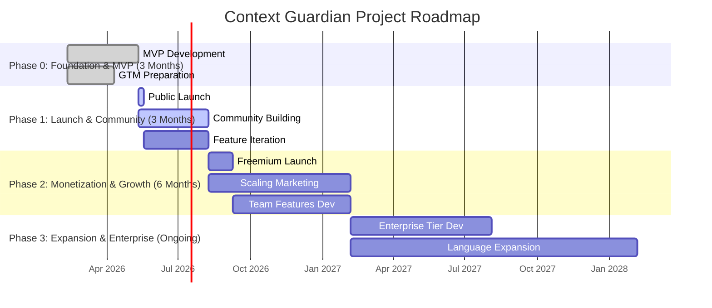

# Context Guardian: Phased Execution Roadmap & Gap Analysis

This document outlines a comprehensive, phase-by-phase plan for the development, launch, and growth of Context Guardian. It integrates product development, go-to-market strategy, and business operations, with a critical analysis of potential gaps and risks at each stage.

## Overall Project Timeline

---

## Phase 0: Foundation & MVP Development (Months 1-3)

**Primary Goal**: Build a functional, high-quality Minimum Viable Product (MVP) and prepare for a strong public launch. The focus is on core functionality and establishing initial credibility.

| Stream                    | Key Activities & Deliverables                                                                                                                                                                                                                                                                                                                                                                                                                                                                                                                                                                                                                                                                                                                                                                                                                                    | Gap Analysis & Mitigation                                                                                                                                                                                                                                                                                                                                                                                                                                                                                                                                     |
| :------------------------ | :--------------------------------------------------------------------------------------------------------------------------------------------------------------------------------------------------------------------------------------------------------------------------------------------------------------------------------------------------------------------------------------------------------------------------------------------------------------------------------------------------------------------------------------------------------------------------------------------------------------------------------------------------------------------------------------------------------------------------------------------------------------------------------------------------------------------------------------------------------------- | :------------------------------------------------------------------------------------------------------------------------------------------------------------------------------------------------------------------------------------------------------------------------------------------------------------------------------------------------------------------------------------------------------------------------------------------------------------------------------------------------------------------------------------------------------------ |
| **Product & Engineering** | **1. Core CLI Tool**: Develop the Codebase Analyzer in TypeScript/Node.js. Implement dependency parsing for npm, pip, and cargo.   **2. AST Parser Integration**: Integrate Tree-sitter for basic pattern recognition (imports, function styles) in JS/TS and Python.   **3. Cloud API & DB**: Set up Supabase (PostgreSQL) and deploy Node.js API on Fly.io/Railway (always-on server).   **4. Caching Layer**: Integrate Upstash Redis for playbook caching (24hr TTL).   **5. Offline Fallback**: Bundle SQLite database with top 100 libraries for offline mode.   **6. Initial Data Seeding**: Manually research and populate the Best Practices DB for the top 20 libraries in the JS/Python ecosystems.   **7. VS Code Extension**: Build a basic extension that triggers the CLI and injects the `.guardian.md` file into the context. | **Gap**: The quality of the initial best practices data is critical. Poor advice will destroy trust.   **Mitigation**: All initial data must be manually curated and double-checked against official documentation. Each rule must link to its source for verification.    **Gap**: Tree-sitter parsing can be complex. Over-engineering the initial pattern recognition could delay the MVP.   **Mitigation**: Focus only on high-value, simple-to-detect patterns for the MVP. Defer complex architectural analysis.                            |
| **Marketing & GTM**       | **1. Foundational Content**: Write 5-7 deep, technical blog posts about the problems of AI-generated code and the principles behind Context Guardian.   **2. Landing Page**: Create a simple, clear landing page with a waitlist/email signup.   **3. Documentation**: Write comprehensive, high-quality documentation for the CLI and VS Code extension. This is a marketing asset.   **4. Initial Community**: Create a Discord server and invite a small group of 20-30 beta testers from personal networks.                                                                                                                                                                                                                                                                                                                                         | **Gap**: Building an audience from scratch is slow. A launch without a pre-existing audience may fall flat.   **Mitigation**: Start content marketing from day one. Founders should be active on LinkedIn/Twitter, sharing the building process. Engage with beta testers to create initial advocates.    **Gap**: If documentation is poor, developers will not adopt the tool, regardless of its quality.   **Mitigation**: Treat documentation as a primary feature. Include code examples, video snippets, and a clear getting-started guide. |
| **Business & Operations** | **1. Define KPIs**: Set initial success metrics: GitHub stars, waitlist signups, beta tester feedback quality.   **2. Legal**: Draft Terms of Service and a Privacy Policy that clearly states no source code is ever sent to the cloud.   **3. Feedback Loop**: Establish a structured process for collecting and prioritizing feedback from beta testers (e.g., using GitHub Issues or a dedicated Discord channel).                                                                                                                                                                                                                                                                                                                                                                                                                                     | **Gap**: Lack of clear success metrics can lead to unfocused development.   **Mitigation**: Define and track a small set of key metrics weekly. The primary goal is user love from the beta group, not vanity metrics.    **Gap**: Ignoring early feedback can lead to building a product nobody wants.   **Mitigation**: The founding team must be deeply involved in the beta community, responding to every piece of feedback personally.                                                                                                      |

---

## Phase 1: Public Launch & Community Building (Months 4-6)

**Primary Goal**: Successfully launch the free version of Context Guardian, drive initial adoption, and build a vibrant, engaged community around the product.

| Stream                    | Key Activities & Deliverables                                                                                                                                                                                                                                                                                                                                                                                                                                                                                                      | Gap Analysis & Mitigation                                                                                                                                                                                                                                                                                                                                                                                                                                                                           |
| :------------------------ | :--------------------------------------------------------------------------------------------------------------------------------------------------------------------------------------------------------------------------------------------------------------------------------------------------------------------------------------------------------------------------------------------------------------------------------------------------------------------------------------------------------------------------------- | :-------------------------------------------------------------------------------------------------------------------------------------------------------------------------------------------------------------------------------------------------------------------------------------------------------------------------------------------------------------------------------------------------------------------------------------------------------------------------------------------------- |
| **Product & Engineering** | **1. Public Release**: Publish the CLI to npm and the extension to the VS Code Marketplace.   **2. Rapid Iteration**: Dedicate 80% of engineering time to fixing bugs and implementing high-priority features requested by the community.   **3. Expand Data**: Double the number of libraries in the Best Practices DB, focusing on community requests.   **4. Improve Analytics**: Implement product analytics (e.g., PostHog) to understand usage patterns (which commands are used, which libraries are most common). | **Gap**: A buggy or slow initial release can permanently damage reputation.   **Mitigation**: Rigorous testing with the beta community before public launch. Have a hotfix release process ready.    **Gap**: Usage might be low, making it hard to gather meaningful data.   **Mitigation**: Proactively reach out to early adopters for 1-on-1 feedback sessions. Make it incredibly easy to report issues and suggest features.                                                      |
| **Marketing & GTM**       | **1. Coordinated Launch**: Execute the multi-day launch plan across Hacker News, Reddit, Product Hunt, and social media.   **2. Community Management**: Actively manage the Discord and GitHub communities. Answer every question, acknowledge every feature request.   **3. Content Cadence**: Publish one high-quality technical blog post or tutorial per week.   **4. Creator Outreach**: Begin building relationships with relevant YouTubers and newsletter authors. Offer them early access and support.           | **Gap**: The launch gets lost in the noise.   **Mitigation**: The launch message must be sharp and clear. Focus on the core pain point: "Stop your AI from writing bad code." Use compelling demos and testimonials from beta testers.    **Gap**: Community becomes a ghost town after the initial launch spike.   **Mitigation**: The founding team must be consistently present. Host weekly office hours, share development progress openly, and celebrate community contributions. |
| **Business & Operations** | **1. Track Growth Metrics**: Monitor GitHub stars, npm downloads, VS Code installs, and active users.   **2. User Segmentation**: Begin to identify different user personas (e.g., hobbyist, professional, student) based on usage and feedback.   **3. Plan Monetization**: Start designing the architecture for the Pro and Team tiers based on observed usage patterns and feature requests.                                                                                                                              | **Gap**: Focusing too much on vanity metrics (like stars) instead of active usage.   **Mitigation**: Prioritize Weekly Active Users (WAU) as the North Star metric. A user who installs and uses the tool weekly is far more valuable than one who just stars the repo.    **Gap**: Prematurely focusing on revenue instead of user value.   **Mitigation**: Keep this phase entirely focused on building a product that users love. Monetization is the goal of the next phase.        |

---

## Phase 2: Monetization & Growth (Months 7-12)

**Primary Goal**: Successfully introduce paid tiers, validate the business model by converting free users to paid, and begin scaling user acquisition beyond the initial community.

| Stream                    | Key Activities & Deliverables                                                                                                                                                                                                                                                                                                                                                                                                                                                                                                                                                                  | Gap Analysis & Mitigation                                                                                                                                                                                                                                                                                                                                                                                                                                                                                                                                                                                                        |
| :------------------------ | :--------------------------------------------------------------------------------------------------------------------------------------------------------------------------------------------------------------------------------------------------------------------------------------------------------------------------------------------------------------------------------------------------------------------------------------------------------------------------------------------------------------------------------------------------------------------------------------------- | :------------------------------------------------------------------------------------------------------------------------------------------------------------------------------------------------------------------------------------------------------------------------------------------------------------------------------------------------------------------------------------------------------------------------------------------------------------------------------------------------------------------------------------------------------------------------------------------------------------------------------- |
| **Product & Engineering** | **1. Billing Integration**: Integrate Stripe for subscription management and payment processing.   **2. Develop Pro/Team Features**: Build the features that differentiate the paid tiers, such as higher API limits, private best practice repositories, and shared team playbooks.   **3. User Accounts & SSO**: Implement user authentication and organization management. Add SSO (SAML, OIDC) for team accounts.   **4. Scale Infrastructure**: Optimize database queries and API performance to handle increased load from paying customers.                                    | **Gap**: The value proposition for the paid tiers may not be strong enough to drive conversions.   **Mitigation**: Base the paid features directly on the most common and painful problems identified in the community during Phase 1. Offer a time-limited discount to early adopters to encourage conversion and gather feedback.    **Gap**: Building billing and authentication is complex and can introduce security risks.   **Mitigation**: Use trusted third-party services like Stripe and an auth provider (e.g., Auth0, Clerk) instead of building from scratch. Conduct a security review before launch. |
| **Marketing & GTM**       | **1. Launch Paid Tiers**: Announce the Pro and Team plans via blog posts, email newsletters, and community channels.   **2. Create Comparison Content**: Write articles and create landing pages comparing Context Guardian to alternatives (e.g., "Context Guardian vs. manual .cursorrules").   **3. Targeted Marketing**: Begin small, targeted ad campaigns on platforms like LinkedIn, Twitter, and Carbon Ads, focusing on developers and tech leads.   **4. Sponsor Content**: Sponsor a few high-quality developer newsletters or YouTube channels that align with the brand. | **Gap**: Marketing to developers is notoriously difficult. Traditional ads can backfire if they feel inauthentic.   **Mitigation**: All marketing content must remain developer-first. Ads should point to technical blog posts or tutorials, not generic sales pages. The message should focus on solving a technical problem, not on business benefits.    **Gap**: Poor conversion rate could signal a flawed business model.   **Mitigation**: Track the conversion funnel closely. Use analytics to see where users drop off. Be prepared to iterate on pricing, packaging, and messaging based on the data.    |
| **Business & Operations** | **1. Monitor Business Metrics**: Track MRR, free-to-paid conversion rate, churn, and Customer Acquisition Cost (CAC).   **2. First Non-Founder Hire**: Hire a Developer Advocate to help with community management, content creation, and customer support.   **3. Formalize Sales**: Create a simple process for handling inbound leads for the Team plan.   **4. Financial Modeling**: Build a financial model to project revenue and burn rate, and to inform future fundraising or hiring decisions.                                                                              | **Gap**: Hiring the wrong person for the first non-founder role can be culturally disruptive.   **Mitigation**: The first hire must be a strong cultural fit—a developer who loves community and teaching. Involve the beta community in the interview process to get their feedback.    **Gap**: Inaccurate financial projections can lead to running out of cash.   **Mitigation**: Be conservative with conversion rate and growth assumptions. Model out a few scenarios (pessimistic, realistic, optimistic).                                                                                                   |

---

## Phase 3: Expansion & Enterprise (Months 13+)

**Primary Goal**: Scale the business by capturing the enterprise market, expanding to new ecosystems, and establishing Context Guardian as an industry-standard tool.

| Stream                    | Key Activities & Deliverables                                                                                                                                                                                                                                                                                                                                                                                                                                                                                                                                                                                                                                                                 | Gap Analysis & Mitigation                                                                                                                                                                                                                                                                                                                                                                                                                                                                                                                                                                                                                 |
| :------------------------ | :-------------------------------------------------------------------------------------------------------------------------------------------------------------------------------------------------------------------------------------------------------------------------------------------------------------------------------------------------------------------------------------------------------------------------------------------------------------------------------------------------------------------------------------------------------------------------------------------------------------------------------------------------------------------------------------------- | :---------------------------------------------------------------------------------------------------------------------------------------------------------------------------------------------------------------------------------------------------------------------------------------------------------------------------------------------------------------------------------------------------------------------------------------------------------------------------------------------------------------------------------------------------------------------------------------------------------------------------------------- |
| **Product & Engineering** | **1. Enterprise-Grade Features**: Develop a self-hosted version of Context Guardian. Implement advanced features like Role-Based Access Control (RBAC), audit logs, and integration with internal documentation sources (e.g., Confluence).   **2. Language Expansion**: Aggressively add support for more languages based on enterprise demand (e.g., Java, C#, Go, Ruby).   **3. Deeper Code Analysis**: Move beyond basic patterns to more sophisticated architectural analysis using the AST, such as detecting anti-patterns in data flow or state management.   **4. Public API**: Launch a public API to allow other developer tools to integrate with the Best Practices DB. | **Gap**: Enterprise requirements (security, compliance, stability) are far more stringent than for individual developers.   **Mitigation**: Achieve SOC 2 Type 2 and/or ISO 27001 certification. Dedicate a portion of the engineering team to focus solely on security, reliability, and enterprise-specific features.    **Gap**: The data ingestion pipeline may not scale to cover hundreds of libraries and frameworks across multiple languages.   **Mitigation**: Invest in building a more automated, AI-powered data ingestion pipeline with better validation and a stronger human-in-the-loop moderation platform. |
| **Marketing & GTM**       | **1. Build Enterprise Sales Team**: Hire a small, highly technical sales team focused on landing and expanding large enterprise accounts.   **2. Analyst Relations**: Begin engaging with industry analysts at firms like Gartner and Forrester to build credibility and create a new market category.   **3. Strategic Partnerships**: Form official partnerships with IDE vendors, cloud providers, and major players in the DevOps space.   **4. High-Profile Case Studies**: Develop and promote in-depth case studies with well-known enterprise customers.                                                                                                                     | **Gap**: A bottom-up, developer-led GTM motion does not automatically translate to top-down enterprise sales.   **Mitigation**: Hire a sales leader with experience in selling developer tools to enterprises. The sales team must be technical enough to have credible conversations with engineering leaders.    **Gap**: Competitors (including large incumbents like GitHub or Snyk) may start to build similar features.   **Mitigation**: Double down on the community and the quality of the best practices data—this is the core moat. Move faster and maintain a relentless focus on developer experience.           |
| **Business & Operations** | **1. Strategic Fundraising (Series A)**: Raise a Series A to fund team expansion and enterprise GTM efforts.   **2. Scale the Team**: Hire key leadership roles (e.g., Head of Sales, Head of Marketing, Head of Engineering).   **3. International Expansion**: Begin localizing the product and marketing for key international markets (e.g., Europe, Asia).   **4. Formalize Support**: Build a dedicated customer support team to provide 24/7 support for enterprise customers with SLAs.                                                                                                                                                                                      | **Gap**: Scaling company culture is notoriously difficult.   **Mitigation**: Codify the company mission, vision, and values early. Implement a rigorous hiring process that screens for cultural alignment, not just technical skill.    **Gap**: Profitability may remain elusive as the company invests heavily in growth.   **Mitigation**: Maintain a clear view of unit economics (LTV/CAC). Ensure that the enterprise pricing model is robust enough to fund the growth of the free and low-cost tiers. Raise enough capital to have a 24-36 month runway.                                                             |
